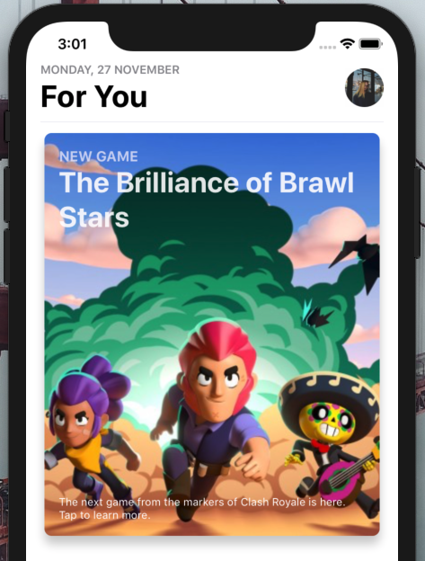
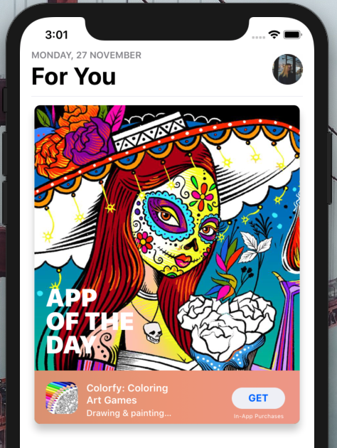

[](https://github.com/WrathChaos/react-native-button)

[](https://github.com/WrathChaos/react-native-apple-card-views)

[](https://www.npmjs.com/package/react-native-apple-card-views)
[](https://www.npmjs.org/package/react-native-apple-card-views)

[](https://opensource.org/licenses/MIT)
[](https://github.com/prettier/prettier)

<p align="center">
  
  
</p>

<p align="center">
  
</p>


Version 3 🥳 🚀
- Only one dependency is required 🏝️
- Other dependencies are removed/extracted
- Expo Compatible 🎪
- Code cleaning 🧹

## Installation & Expo Compatible

Add the dependency:

```bash
npm i react-native-apple-card-views
```

## Peer Dependencies

##### IMPORTANT! You need install them

```json
"@freakycoder/react-native-bounceable": ">= 1.0.3"
```

# Options

- [AppleCard](https://github.com/WrathChaos/react-native-apple-card-views#applecard-usage)
- [AppOfTheDayCard](https://github.com/WrathChaos/react-native-apple-card-views#appofthedaycard-usage)

# Usage

## AppleCard Usage

```jsx
<AppleCard
  source={require("./assets/hero_bg_brawlstars_.jpg")}
  onPress={() => {}}
  smallTitle={"NEW GAME"}
  largeTitle={"The Brilliance of Brawl Starts"}
  footnote={
    "The next game from the markers of Clash Royale is here. Tap to learn more."
  }
/>
```

## AppOfTheDayCard Usage

```jsx
<AppOfTheDayCard
  title={"Colorfy: Coloring Art Games"}
  subtitle={"Drawing & painting for  everyone"}
  largeTitle={"APP" + "\n" + "OF THE" + "\n" + "DAY"}
  buttonText={"GET"}
  iconSource={require("./assets/Colorfy.jpg")}
  backgroundSource={require("./assets/ColorfyBG.jpg")}
  buttonSubtitle={"In-App Purchases"}
  onPress={() => {}}
  onButtonPress={() => {}}
/>
```

### Configuration - Props

#### AppleCard Props

| Property            |   Type   |                                  Default                                   | Description                           |
| ------------------- | :------: | :------------------------------------------------------------------------: | ------------------------------------- |
| source              |  image   |                               default image                                | set the image background              |
| style               |  style   |                                  default                                   | change the style of the card          |
| smallTitle          |  string  |                                  NEW GAME                                  | change the small title                |
| largeTitle          |  string  |                       The Brilliance of Brawl Stars                        | change the main large title           |
| footnoteText        |  string  | The next game from the markers of Clash Royale is here. Tap to learn more. | change the footnote text              |
| backgroundStyle     |  style   |                                  default                                   | set custom style for background image |
| smallTitleTextStyle |  style   |                                  default                                   | set custom style for small title      |
| largeTitleTextStyle |  style   |                                  default                                   | set custom style for large title      |
| footnoteTextStyle   |  style   |                                  default                                   | set custom style for footnote         |
| onPress             | function |                                    null                                    | use this to set onPress functionality |

#### AppOfTheDayCard Props

| Property            |   Type   |              Default              | Description                                       |
| ------------------- | :------: | :-------------------------------: | ------------------------------------------------- |
| style               |  style   |              default              | change the style of the card and image background |
| shadowStyle         |  style   |              default              | change the style of the card's shadow             |
| backgroundSource    |  image   |           default image           | set the image background for main card            |
| iconSource          |  image   |           default image           | set the logo image                                |
| largeTitle          |  string  |         "APP OF THE DAY"          | change the main large title                       |
| title               |  string  |   "Colorfy: Coloring Art Games"   | change the title text                             |
| subtitle            |  string  | "Drawing & painting for everyone" | change the subtitle text                          |
| buttonText          |  string  |               "GET"               | change the button's text                          |
| buttonSubtitle      |  string  |        "In-App Purchases"         | change the button's bottom subtitle               |
| largeTitleTextStyle |  style   |              default              | set the custom style for large title              |
| subtitleTextStyle   |  style   |              default              | set the custom style for subtitle text            |
| titleTextStyle      |  style   |              default              | set the custom style for title text               |
| iconStyle           |  style   |              default              | set the custom style for icon                     |
| buttonOnPress       | function |               null                | set a function for button's onPress               |
| onPress             | function |               null                | set a function for main card's onPress            |

## Roadmap

- [x] ~~`AppleCard` Rewritten and Code Cleaning~~
- [x] ~~`AppleCard` More Customization Options~~

## Author

FreakyCoder, kurayogun@gmail.com

## License

React Native Apple Card Views Library is available under the MIT license. See the LICENSE file for more info.
